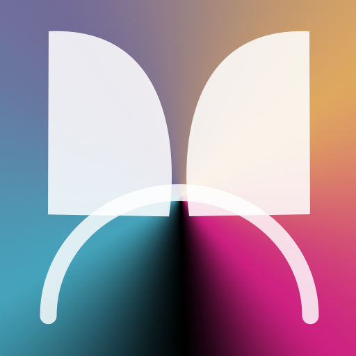

# homebridge-monster-smart-lighting
<p align="center">
  
</p>


[](https://www.npmjs.com/package/homebridge-monster-smart-lighting)
[](https://www.npmjs.com/package/homebridge-monster-smart-lighting)

[](LICENSE)

[](https://github.com/dash16/homebridge-monster-smart-lighting/issues)


# homebridge-monster-smart-lighting

Homebridge plugin for integrating Monster Smart Lighting devices with Apple HomeKit.

This plugin connects to your Monster Smart Lighting account, discovers supported devices automatically, and exposes them to HomeKit through Homebridge.

---

## Features

* HomeKit support for Monster Smart Lighting devices
* Automatic device discovery
* On/Off control
* Brightness control
* Color temperature control
* RGB color control
* RGBIC scene support
* HomeKit state synchronization
* Child bridge compatible
* Homebridge UI configuration support
* Debug logging support for troubleshooting

---

## Supported Platforms and Devices

This plugin supports devices that use the **Monster Smart Lighting** app.

It does **not** support legacy **Monster Illuminessence** devices that use the older Monster Smart app.

[Monster Smart Lighting FAQ](https://monsterilluminessence.com/pages/smart-lighting)

Tested functionality includes:

### Standard Lighting Devices
* Power control
* Brightness control
* Color temperature control
* RGB color control

### RGBIC Devices
* Power control
* Brightness control
* RGB color control
* DIY scenes
* Dynamic scenes
* Static scenes
* Music scenes
* Custom scenes
* Scene visibility controls

If a device appears incorrectly in HomeKit or is missing functionality, please open an issue with:

* The device model
* A screenshot or product link from the Monster Smart Lighting app
* Debug logs

---

## Requirements

* Node.js 20 or newer
* Homebridge v1.8.0 or newer
* A Monster Smart Lighting account
* At least one compatible Monster Smart Lighting device

---

## Installation

Install through the Homebridge UI or manually with npm:

```bash
npm install -g homebridge-monster-smart-lighting
```

After installation:

1. Open the Homebridge UI
2. Add and configure the plugin
3. Enter your Monster Smart Lighting account email and password
4. Restart Homebridge

Devices should appear automatically after startup.

---

## Device Notes

### Color and Color Temperature

Devices that support both RGB color and color temperature are exposed using standard HomeKit Lightbulb characteristics. The Home app presentation may vary slightly depending on the iOS, iPadOS, or macOS version in use.

### RGBIC Features

Compatible RGBIC devices can expose built-in scenes as individual HomeKit switch accessories.

Supported scene categories include:

* DIY
* Dynamic
* Static
* Music
* Custom

Scene categories can be enabled or disabled individually from the Homebridge configuration UI. Individual scenes can also be hidden if desired to reduce accessory count.

At this time, scene activation is supported, but direct segment-level RGBIC editing remains available only through the Monster Smart Lighting app.

---
## Technical Notes

### Authentication Flow

Monster Smart Lighting authentication currently follows a multi-stage cloud flow:

Monster Cloud → Sphere → Ayla

The plugin authenticates with Monster Smart Lighting, exchanges credentials through Sphere services, and ultimately obtains the Ayla credentials used for device discovery and control.

## Troubleshooting

### Device not responding

1. Confirm the device still responds in the Monster Smart Lighting app
2. Restart Homebridge
3. Enable debug logging
4. Check Homebridge logs for authentication or cloud communication errors

### Missing devices

If a device is not discovered:

1. Verify it appears in the Monster Smart Lighting app
2. Enable Homebridge Debug Mode
3. Restart Homebridge
4. Open an issue with:

   * Device model
   * Product screenshot or link
   * Relevant logs

---

## Contributing

Issues and pull requests are welcome.

When reporting bugs, please include:

* Homebridge version
* Node.js version
* Device model(s)
* Relevant logs
* Steps to reproduce

---

## Credits

This plugin was developed through direct observation and analysis of the Monster Smart Lighting mobile application and its cloud communications.

Special thanks to:

* Homebridge
* The Homebridge community and contributors
* Charles Proxy for providing the traffic inspection tooling used during development and protocol analysis

---

## Disclaimer

This project is not affiliated with or endorsed by Monster Smart Lighting, Ayla Networks, or any associated manufacturer.

HomeKit is a trademark of Apple Inc.
